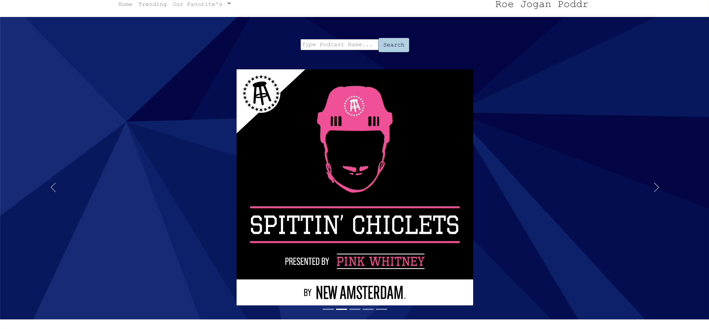
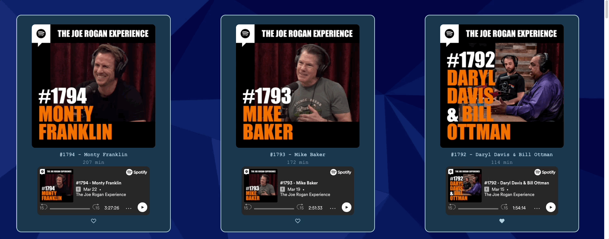

# Roe Jogan Poddr

## Description

- Made in 1 week, Group Project - Contributors   [Nick Alayra](https://github.com/nalayra), [Andrew Wei](https://github.com/weiwei-out)

This project is a podcast search and like app using the Spotify API. The app uses a temporary token to allow the user to search through podcasts and see a list of 50 episodes and to like them which is then persisted on a JSON backend. 

## Features of this App

***

***
- Search for your favorite podcast using the Spotify API
***

***
- Episode display with 50 most recent podcasts 
***

***
ability to like and play any podcast episode shown
***

***

***
- Persistent "likes" for each episode that allow user to remember which episodes were enjoyed
***

***

## Technology Used

- React javascript
- JSON server
- [React Bootstrap](https://react-bootstrap.github.io/),[React-Router](https://reactrouter.com/),[FontAwesome](https://fontawesome.com/)

